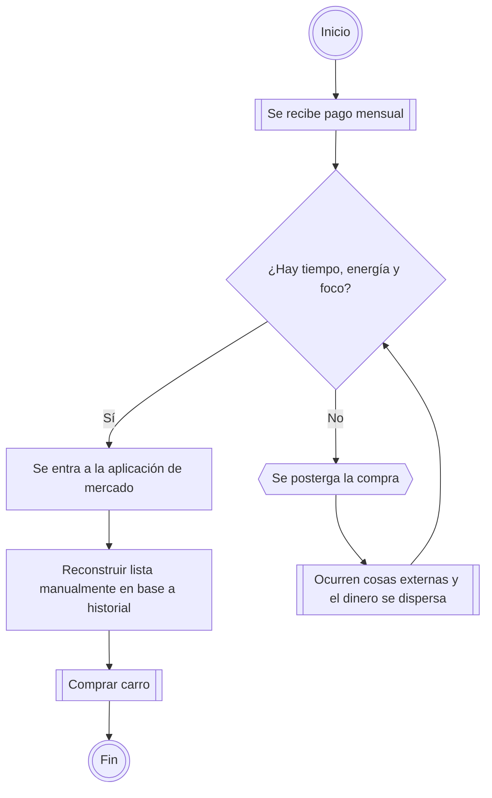

---

id: process.household-shopping
type: [process]
status: active
scope: iteration
related:
  - belongs to [context.scenario](../understanding/context.scenario.md)
  - is improved by [scope.iteration](../understanding/scope.iteration.md)
  - gives terms to [vocabulary.domain](../vocabulary.domain.md)
  - is improved by [proposal.solution](../planning/proposal.solution.md)

---

# Proceso "Compras del hogar"

## Nota

El proceso actual de compra del hogar depende de que exista tiempo, energía y foco justo después de recibir el pago mensual.

Y precisamente esa dependencia es la que en contextos de familias jóvenes, suele derivar en dolores.

## Contexto

Este proceso aparece durante la preparación mensual de compras del hogar.

Actualmente, cuando se recibe el pago mensual, se debe entrar a una aplicación de mercado, revisar productos o compras anteriores, reconstruir manualmente la lista y luego comprar el carro.

El problema aparece cuando no hay tiempo, energía o foco suficiente para reconstruir la lista en ese momento. Cuando eso ocurre, la compra se posterga. Durante la postergación pueden aparecer gastos, urgencias u otras presiones que consumen parte del dinero que debía cubrir la despensa.

El flujo actual no falla porque la compra sea conceptualmente compleja. Falla porque una tarea repetitiva y predecible queda ubicada en el peor momento posible: cuando el dinero ya está disponible y todavía no existe una lista preparada para actuar rápido.

## Por qué importa

Este proceso importa porque muestra dónde está la fragilidad real del escenario.

El problema inicial no es la ausencia de pago automático, integración con mercado o una aplicación completa. El problema inicial es que la lista mensual no existe como intención preparada antes del pago.

Si no se entiende este proceso, es fácil saltar a soluciones demasiado grandes, como automatizar compras completas, manejar pagos o integrar múltiples mercados. Sin embargo, el primer punto de mejora está antes: reducir la fricción de preparar la compra mensual.

Este documento ayuda a justificar que el primer Slice-First debe enfocarse en preparar y persistir una lista mensual accionable, antes de resolver automatización, pagos o capacidades futuras.

## Siguiente acción

1. Usar este proceso como base para definir el flujo actualizado.
2. Documentar oportunidades de mejora futura sin convertirla todavía en alcance obligatorio.
3. Definir y construir el primer Slice-First para aplacar el problema.
4. Documentar notas de validación post-entrega.

