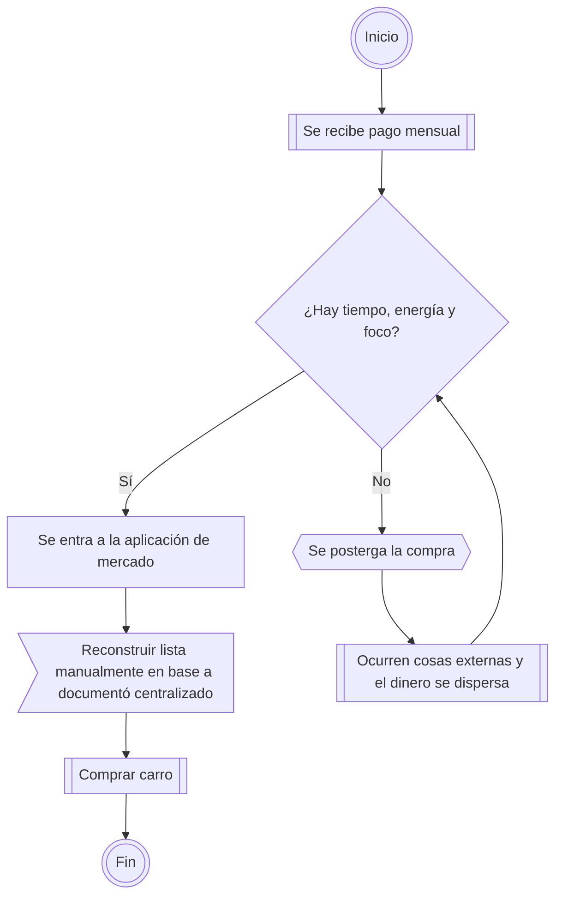

---

id: proposal.solution
type: [proposal]
status: active
scope: iteration
related:
  - will improve [context.scenario](../understanding/context.scenario.md)
  - is contained by [scope.iteration](../understanding/scope.iteration.md)
  - uses [vocabulary.domain](../vocabulary.domain.md)
  - will improve [process.household-shopping](../contextualizing/process.household-shopping.md)
  - details in [improvement.solution](improvement.solution.md)

---

# Propuesta de solución



## Nota

La propuesta de esta iteración es construir una solución pequeña que permita reducir la fricción actual de la compra mensual sin esperar a tener la solución final de Domus Orbis.

El objetivo no es automatizar todo el proceso de compra, construir una aplicación completa o resolver pagos. El objetivo es crear un punto centralizado donde la lista mensual de productos pueda existir antes del pago.

Esta solución debe permitir que los productos de compra no dependan únicamente del carrito de Líder, compras anteriores o memoria humana.

## Contexto

Durante Understanding y Contextualizing se identificó que el problema actual no es la complejidad de la compra mensual, sino el momento en que debe prepararse.

Hoy, después de recibir el pago mensual, se debe entrar a una aplicación de mercado y reconstruir manualmente la lista de productos en el carro. Si no hay tiempo, energía o foco, la compra se posterga y el dinero destinado a despensa puede dispersarse antes de cubrir productos esenciales.

Para reducir este problema, se propone crear un archivo centralizado de compra mensual usando un formato simple, legible y compatible con evolución futura.

La solución rápida será definir un formato YAML que represente mercados y productos de compra. Este archivo podrá usarse manualmente al inicio y luego podrá ser consumido por herramientas futuras, como una aplicación de consola, integración con Playwright, API de mercado o preparación automática de carrito.

## Por qué importa

Esta propuesta importa porque permite resolver parte del problema actual sin esperar a una solución completa.

Tener una lista centralizada permite que la intención de compra mensual exista antes del pago. Esto reduce carga ejecutiva, evita reconstruir la lista desde cero y deja una base más estable para futuras automatizaciones.

También importa porque esta solución no debería ser desechable. Aunque después exista una herramienta más avanzada, el sistema seguirá necesitando saber qué productos se deben comprar, desde qué mercado y en qué cantidad.

El formato inicial debe ser pequeño, pero suficientemente claro para sobrevivir a futuras mejoras.

## Entregables

Los entregables de esta iteración son:

1. Diagnóstico y documentación del contexto actual.
2. Solución pequeña para reducir la fricción del proceso actual.
3. [Plan de mejoras para un siguiente sprint](improvement.solution.md).

## Solución propuesta

Crear un archivo centralizado de compra mensual usando YAML.

El archivo debe permitir registrar uno o más mercados y los productos asociados a cada mercado.

La primera versión del formato debe enfocarse en datos mínimos:

* mercado base;
* nombre del producto;
* enlace del producto;
* cantidad, si el producto se compra por unidades;
* peso, si el producto se compra por peso.

## Esquema base

```yaml

version: 1

nombre: compra-mensual-despensa
mercados:
  - nombre: sample
    urlBase: https://sample.cl
    productos:
      - nombre: Arroz
        url: https://www.lider.cl/supermercado/product/example
        cantidad: 2

      - nombre: Plátano
        url: https://www.lider.cl/supermercado/product/example
        peso: 1.5

```

## Reglas iniciales del formato

* `version` permite evolucionar el formato en el futuro.
* `nombre` permite identificar la lista de compra.
* `mercados` permite que el archivo soporte más de un mercado.
* `urlBase` representa la URL base del mercado.
* `productos` contiene los productos que deben comprarse en ese mercado.
* `nombre` dentro de producto permite revisar la lista de forma humana.
* `url` apunta al producto específico dentro del mercado.
* `cantidad` se usa cuando el producto se compra por unidades.
* `peso` se usa cuando el producto se compra por peso.
* Un producto debería usar `cantidad` o `peso`, no ambos, salvo que el mercado lo requiera explícitamente.

## Siguiente acción

1. Definir las mejoras posibles para el siguiente sprint.
2. Crear el primer archivo de compra mensual usando YAML. 
3. Hacer entrega del artifact al cliente.
4. Usar esta propuesta como base para Iteration 1.
5. Documentar notas de validación post-entrega.
