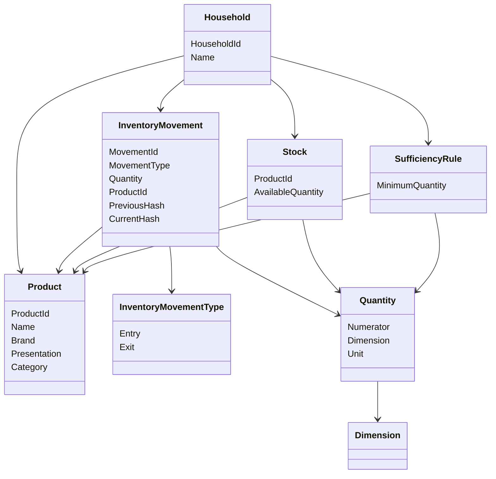
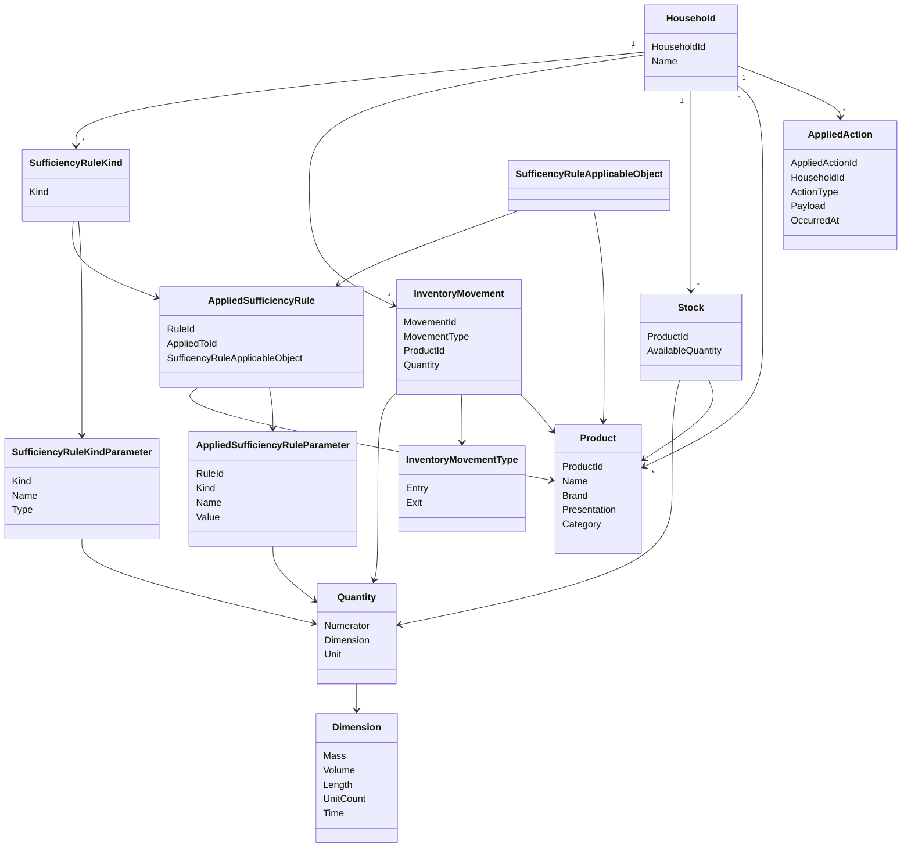

# Vista lógica: Gestión de productos del hogar

## Objetivo de la vista

Describir los principales conceptos del dominio involucrados en la gestión de productos del hogar, sus relaciones conceptuales, responsabilidades, invariantes y decisiones iniciales de modelado.

Esta vista no busca representar todavía detalles técnicos de implementación, persistencia o infraestructura, sino construir una representación conceptual coherente del dominio que permita evolucionar el sistema de forma consistente.

La vista lógica toma como base las decisiones definidas en la vista de casos de uso, especialmente la simplificación del flujo a operaciones fundamentales de entrada y salida de inventario.

---

# Principio central del dominio

El principio fundamental del dominio es:

```text
El hogar cambia mediante acciones. 
```

El estado observable del hogar y sus derivados, como el inventario actual, no representa la fuente primaria de verdad del sistema.

La fuente primaria de verdad corresponde a la secuencia de acciones registrados del hogar.

El stock observable corresponde a una representación materializada o derivada de dichas acciones.

Esto implica que:

* Toda modificación relevante del hogar o algún elemento dentro de el debe expresarse mediante una acción.
* El hogar no puede modificarse arbitrariamente sin generar trazabilidad.
* La consistencia del hogar depende de la consistencia de la secuencia de movimientos.
* Las acciones del hogar, (En este momento: movimientos de inventario, entrada o salida de productos), representan abstracciones que nacen como "resultado" de la ejecución de un caso de uso en un elemento del dominio.

---

# Conceptos principales del dominio

## Household

Representa el hogar al cual pertenece el inventario.

En la primera iteración, cada instalación de la aplicación se asociará a un único hogar.

El hogar actúa como contenedor lógico de la secuencia de acciones aplicadas en los otros elementos relacionados a un hogar, tales como:

* Inventario.
* Reglas de suficiencia.
* Integrantes.
* Estado observable del inventario.

### Responsabilidades conceptuales

* Definir el contexto de acciones.
* Mantener coherencia secuencial de las acciones.
* Mantener la secuencia de movimientos.
* Actuar como raíz lógica de consistencia.

### Preguntas futuras

* Cómo sincronizar múltiples integrantes.
* Cómo compartir estado entre dispositivos.
* Cómo resolver inconsistencias distribuidas.

---

## Product

Representa un producto identificable dentro del hogar.

Un producto no representa necesariamente una existencia física específica, sino una definición identificable de un elemento inventariable.

Ejemplos:

* Arroz Tucapel 1kg.
* Coca Cola Zero 2L.
* Shampoo Head & Shoulders 400ml.

### Atributos conceptuales iniciales

| Atributo     | Descripción                        |
| ------------ | ---------------------------------- |
| Id           | Identificador interno del producto |
| Name         | Nombre principal del producto      |
| Brand        | Marca del producto                 |
| Presentation | Forma de presentación o empaque    |
| Category     | Clasificación general              |

### Responsabilidades conceptuales

* Representar identidad funcional del producto.
* Permitir diferenciación entre productos similares.
* Actuar como referencia para movimientos de inventario.
* Definir restricciones compatibles con sus unidades permitidas.

### Observaciones importantes
* El producto no contiene ubicación.
* El producto no contiene vencimiento.
* El producto no representa lotes específicos.
* El producto no contiene directamente reglas de suficiencia.

---

## InventoryMovement

Representa una modificación verificable del inventario.

Es el concepto más importante del dominio.

Todo cambio relevante del inventario debe expresarse mediante un movimiento.

### Tipos fundamentales

En Iteración 1 solo existirán dos tipos:

* Entry
* Exit

### Ejemplos conceptuales

Entradas:

* Compra.
* Reposición.
* Registro inicial.
* Recuperación.

Salidas:

* Consumo.
* Agotamiento.
* Pérdida.
* Descarte.
* Ajuste manual.

Los subtipos especializados aparecerán en iteraciones posteriores.

---

## InventoryMovementType

Representa la naturaleza fundamental del movimiento.

### Valores iniciales

| Tipo  | Significado      |
| ----- | ---------------- |
| Entry | Incrementa stock |
| Exit  | Reduce stock     |

### Evolución futura

Posteriormente podrían existir subtipos derivados:

* Consumption
* Disposal
* Loss
* ManualAdjustment
* Restock

---

## Quantity

Representa una cantidad tipada asociada a una dimensión física.

El objetivo principal de este concepto es evitar operaciones inválidas entre dimensiones incompatibles.

Ejemplos válidos:

* 1 kg + 500 g
* 2 L + 500 ml

Ejemplos inválidos:

* 1 kg + 2 L
* 3 unidades + 400 ml

### Componentes conceptuales

| Componente | Descripción          |
| ---------- | -------------------- |
| Numerator  | Valor numérico       |
| Dimension  | Tipo físico asociado |
| Unit       | Unidad específica    |

### Responsabilidades conceptuales

* Garantizar compatibilidad dimensional.
* Permitir operaciones válidas entre unidades hermanas.
* Evitar inconsistencias semánticas.

### Relación con VSlices

La implementación utilizará las capacidades tipadas del framework VSlices para modelar dimensiones físicas y operaciones compatibles.

---

## Dimension

Representa una dimensión física compatible.

Ejemplos:

* Mass
* Volume
* Length
* UnitCount
* Time

Una dimensión define:

* Qué unidades son compatibles entre sí.
* Qué operaciones son válidas.
* Qué conversiones son posibles.

---

## Stock

Representa el estado observable actual de disponibilidad de un producto.

### Observación importante

El stock no representa la fuente primaria de verdad.

El stock corresponde a una proyección materializada derivada desde movimientos.

Sin embargo, en Iteración 1:

* El stock será persistido.
* Los movimientos actualizarán directamente el stock observable.
* El historial permitirá reconstrucción futura si es necesario.

### Responsabilidades conceptuales

* Exponer disponibilidad actual.
* Facilitar consultas rápidas.
* Permitir evaluación de suficiencia.

---

## SufficiencyRule

Representa una regla que permite determinar si una existencia es suficiente o insuficiente.

Este concepto se modela separado del producto porque:

* La suficiencia depende del contexto.
* La suficiencia puede evolucionar.
* Distintas reglas podrían aplicarse sobre el mismo producto.

### Ejemplos conceptuales

* Mínimo de 2 litros de leche.
* Mínimo de 1kg de arroz.
* Mínimo de 7 días de alimento de mascota.

### Responsabilidades conceptuales

* Definir umbrales mínimos.
* Permitir evaluación automática.
* Separar políticas del producto.

### Observación importante

En Iteración 1:

* Las reglas serán simples.
* Principalmente umbrales mínimos directos.
* No existirán predicciones avanzadas.

---

## AppliedAction

Representa una acción ocurrida en un hogar, permitiendo tener trazabilidad de todos los cambios, en cualquier elementos que este relacionado.

Este concepto es el que se empleará para la reconstrucción de un hogar en nuevos dispositivos, permitiendo de esta forma que exista una fuente de verdad compartida y replicable 

### Ejemplos conceptuales

* Registrado un producto nuevo.
* Registrado un movimiento de inventario.
* Registrado una nueva regla de suficiencia.
* Eliminado una regla de suficiencia.

### Responsabilidades conceptuales

* Permitir reconstrucción del hogar.
* Servir como verificador de integridad.

### Observación importante

* Cada caso de uso que sea accionado por el usuario, si se ejecuta con exito, debe generar una acción aplicada que permita reconstruir el estado del hogar en cualquier dispositivo nuevo o existente.

---

# Relaciones conceptuales



---

# Invariantes conceptuales

## El hogar es la raíz de consistencia
El hogar actúa como contenedor lógico de la secuencia de acciones aplicadas en los otros elementos relacionados a un hogar.

---

## Toda modificación del inventario ocurre mediante movimientos

No puede existir modificación directa de stock sin un movimiento asociado.

---

## El stock no puede ser negativo

Una salida no puede producir una disponibilidad menor a cero.

---

## No pueden mezclarse dimensiones incompatibles

Las operaciones entre cantidades deben respetar compatibilidad dimensional.

Ejemplo:

* Masa con masa.
* Volumen con volumen.

No:

* Masa con volumen.
* Volumen con unidades discretas.

---

## Todo movimiento debe pertenecer a un hogar

No existen movimientos globales o huérfanos.

---

## Todo movimiento debe referenciar un producto válido

Un movimiento no puede existir sin producto asociado.

---

## Todo movimiento debe ser verificable

Cada movimiento debe mantener relación verificable con el movimiento anterior.

El objetivo es detectar inconsistencias o alteraciones no autorizadas en la secuencia histórica.

---

# Decisiones iniciales de modelado

## El dominio se modelará alrededor de movimientos

El sistema no se organizará principalmente alrededor de productos estáticos, sino alrededor de cambios verificables del inventario.

---

## Entrada y salida son las operaciones fundamentales

Los subtipos especializados quedan fuera de Iteración 1.

---

## Ubicación queda fuera del núcleo inicial

Aunque relevante, agregar ubicación tempranamente introduciría complejidad accidental sobre:

* Identidad.
* Agrupación.
* Existencias.
* Consultas.
* Suficiencia.

---

## Vencimiento queda fuera del núcleo inicial

El vencimiento requiere modelar existencias específicas o lotes.

---

## Las reglas de suficiencia se separan del producto

El producto no define directamente cuándo una cantidad es suficiente.

---

## El stock observable será persistido

Aunque conceptualmente derivable, persistir stock facilita:

* Consultas rápidas.
* Simplicidad inicial.
* Menor costo computacional.

---

## El historial de acciones es verificable

Cada acción mantiene relación encadenada con la anterior mediante hashes verificables.

El objetivo no es construir un sistema blockchain, sino un historial resistente a inconsistencias y manipulaciones accidentales.

---

# Evoluciones futuras detectadas

La vista lógica actual reconoce futuras extensiones naturales:

## Ubicaciones explícitas

Permitirá:

* Inventario distribuido.
* Consultas espaciales.
* Reglas por ubicación.

---

## Existencias específicas

Permitirá:

* Lotes.
* Vencimientos.
* FIFO/FEFO.

---

## Movimientos especializados

Permitirá:

* Consumption
* Disposal
* Loss
* Restock
* ManualAdjustment

---

## Historial visible para usuarios

Permitirá trazabilidad consultable.

---

## Reglas avanzadas de suficiencia

Permitirá:

* Predicción de consumo.
* Reglas temporales.
* Patrones históricos.

---

## Múltiples integrantes sincronizados

Permitirá:

* Hogares compartidos.
* Resolución distribuida.
* Consenso de historial.

---

# Riesgos conceptuales identificados

## Riesgo de complejidad prematura

Agregar tempranamente:

* Ubicación
* Vencimiento
* Lotes
* Reglas avanzadas

podría hacer explotar el núcleo inicial.

---

## Riesgo de acoplar reglas al producto

La suficiencia no debe quedar embebida directamente en Product.

---

## Riesgo de modelar stock como única verdad

El stock observable puede desincronizarse.

La trazabilidad real debe mantenerse en movimientos.

---

# Síntesis de la vista

La primera iteración del modelo lógico se centra en una idea fundamental:

```text
El hogar es una secuencia verificable de acciones que produce estados observables, tales como los productos usados o el inventario disponible.
```

El dominio se simplifica inicialmente a:

* Productos identificables.
* Movimientos de entrada y salida.
* Cantidades tipadas.
* Stock observable.
* Reglas básicas de suficiencia.
* Historial de acciones realizadas.

Esta reducción busca construir primero un núcleo pequeño, consistente y extensible antes de introducir conceptos más complejos como ubicación, vencimiento, lotes o sincronización avanzada.

