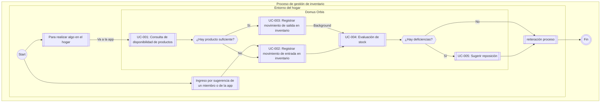

```mermaid
 graph TD 
	subgraph P[Proceso de gestión de inventario]
		ST@{ shape: circle, label: "Start" }
		FI@{ shape: dbl-circ, label: "Fin" }

		subgraph L[Entorno del hogar]

			ST --> D1@{ shape: subproc, label: "Ingreso por sugerencia de un miembro o de la app" }

			ST --> D2@{ shape: subproc, label: "Para realizar algo en el hogar" }
		
			D1 --> UC2
			D2 --> |Va a la app| UC1
			
			subgraph S[Domus Orbis]

				UC4 --> PSE@{ shape: hex, label: "¿Hay deficiencias?" }

				UC1@{ shape: subproc, label: "UC-001: Consulta de disponibilidad de productos" }

				UC2@{ shape: subproc, label: "UC-002: Registrar movimiento de entrada en inventario" }

				UC4@{ shape: subproc, label: "UC-004: Evaluación de stock" }

				UC3@{ shape: subproc, label: "UC-003: Registrar movimiento de salida en inventario" }

				UC3 --> |Background| UC4

				UC5@{ shape: subproc, label: "UC-005: Sugerir reposición" }

				PSE --> |Sí| UC5

				UC1 --> PSD@{ shape: hex, label: "¿Hay producto suficiente?" }

				PSD -->|Sí| UC3

				PSD -->|No| UC2

				UC2 --> UC4
			end			
			
			RE@{ shape: subproc, label: "reiteración proceso" }

			PSE --> |No| RE
			UC5 --> RE

		end

		RE --> FI
	end
```