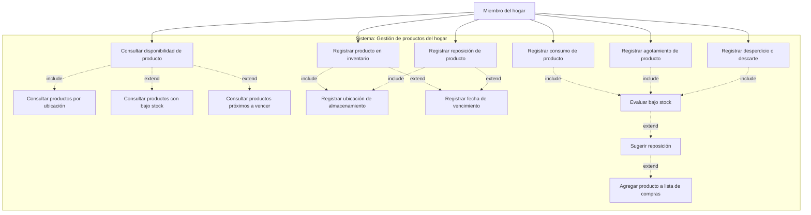

# Vista de casos de uso: Gestión de productos del hogar

## Objetivo de la vista
Describir los casos de uso candidatos para el flujo de gestión de productos del hogar, tomando como base el escenario manual previamente identificado.

Esta vista busca representar qué capacidades debería ofrecer el sistema para apoyar a los miembros del hogar en la consulta, incorporación, reposición, consumo y control de productos existentes en el inventario doméstico.

El objetivo principal no es definir todavía la implementación técnica, sino establecer una lectura funcional del sistema: qué actores interactúan con él, qué acciones realizan, qué problemas del flujo manual se intentan mitigar y qué casos quedan fuera del alcance inicial.

Esta vista servirá como punto de entrada para las siguientes vistas del modelo 4+1, especialmente la vista lógica y la vista de procesos.


## Contexto del escenario manual

En el flujo manual, la gestión de productos del hogar ocurre principalmente mediante observación física, memoria individual y comunicación informal entre miembros del hogar.

Cuando una persona necesita saber si un producto está disponible, normalmente debe ir a una o más ubicaciones y revisar físicamente si existe stock. Cuando se compra un producto, este se incorpora al inventario físico al ser guardado, pero no necesariamente queda disponible como conocimiento compartido. Cuando se consume o usa un producto, el stock real disminuye, pero ese cambio rara vez queda registrado.

Esto provoca problemas como:

- Falta de visibilidad sobre productos disponibles.
- Falta de trazabilidad sobre entradas, salidas, descartes y pérdidas.
- Dependencia de memoria individual.
- Conocimiento fragmentado entre miembros del hogar.
- Compras duplicadas.
- Sobrestock.
- Quiebres de stock detectados demasiado tarde.
- Pérdida de productos por vencimiento.
- Dificultad para saber dónde se encuentra cada producto.
- Dificultad para saber si una cantidad disponible es suficiente.

La aplicación busca reducir estas fricciones entregando una representación consultable, actualizable y compartida del inventario del hogar.

---
## Diagrama de casos de uso del escenario manual

El siguiente diagrama representa los casos de uso candidatos derivados del escenario manual de gestión de productos del hogar.

El objetivo no es modelar todavía la solución técnica, sino identificar qué capacidades debería ofrecer el sistema para reducir los problemas detectados en el flujo manual: falta de visibilidad, falta de trazabilidad, dependencia de memoria, baja coordinación, sobrestock, quiebres de stock y pérdida de productos por vencimiento.



### Lectura del diagrama

El miembro del hogar es el actor principal del flujo.

El sistema debe permitir consultar el inventario, registrar nuevas existencias, registrar reposiciones y registrar salidas de inventario provocadas por consumo, agotamiento o descarte.

Después de cada operación que modifica el stock, el sistema puede evaluar condiciones derivadas, como bajo stock o necesidad de reposición. Estas condiciones pueden terminar en una sugerencia de compra o en la incorporación del producto a una lista de compras.

Las relaciones ```include``` representan comportamientos que forman parte necesaria de otro caso de uso. Por ejemplo, registrar un producto requiere indicar al menos una ubicación de almacenamiento.

Las relaciones ```extend``` representan comportamientos condicionales. Por ejemplo, registrar una fecha de vencimiento solo aplica cuando el producto lo requiere, y sugerir reposición solo ocurre si luego de evaluar el stock se detecta una condición relevante.

## Actor principal en sistema propuesto

### Miembro del hogar

Representa a cualquier persona que vive en el hogar o participa en su administración cotidiana.

En el sistema propuesto, el miembro del hogar puede consultar información del inventario, registrar productos, registrar reposiciones, registrar consumos, declarar agotamientos, descartar productos y revisar condiciones relevantes como bajo stock o vencimiento próximo.

No se distingue inicialmente entre perfiles avanzados como administrador, comprador o consumidor. Para esta iteración, todos estos comportamientos se concentran en el actor Miembro del hogar.

Esta decisión mantiene simple el modelo inicial y evita introducir permisos o jerarquías antes de entender mejor el dominio.

Responsabilidades funcionales del actor
* Consultar productos disponibles.
* Consultar productos por ubicación.
* Registrar productos nuevos.
* Registrar reposición de productos existentes.
* Registrar consumo o uso de productos.
* Registrar agotamiento de productos.
* Registrar desperdicio o descarte.
* Revisar productos con bajo stock.
* Revisar productos próximos a vencer.
* Agregar productos a una lista de compras cuando corresponda.

## Casos de uso candidatos
Los siguientes casos de uso derivan de los problemas observados en el escenario manual

| Código | Caso de uso                           | Actor principal   | Tipo              | Prioridad inicial        |
| ------ | ------------------------------------- | ----------------- | ----------------- | ------------------------ |
| UC-001 | Consultar disponibilidad de producto  | Miembro del hogar | Consulta          | Alta                     |
| UC-002 | Consultar productos por ubicación     | Miembro del hogar | Consulta          | Alta                     |
| UC-003 | Consultar productos con bajo stock    | Miembro del hogar | Consulta          | Media                    |
| UC-004 | Consultar productos próximos a vencer | Miembro del hogar | Consulta          | Media                    |
| UC-005 | Registrar producto en inventario      | Miembro del hogar | Comando           | Alta                     |
| UC-006 | Registrar reposición de producto      | Miembro del hogar | Comando           | Alta                     |
| UC-007 | Registrar ubicación de almacenamiento | Miembro del hogar | Comando / soporte | Alta                     |
| UC-008 | Registrar fecha de vencimiento        | Miembro del hogar | Comando / soporte | Media                    |
| UC-009 | Registrar consumo de producto         | Miembro del hogar | Comando           | Alta                     |
| UC-010 | Registrar agotamiento de producto     | Miembro del hogar | Comando           | Media                    |
| UC-011 | Registrar desperdicio o descarte      | Miembro del hogar | Comando           | Media                    |
| UC-012 | Evaluar bajo stock                    | Sistema           | Regla derivada    | Alta                     |
| UC-013 | Sugerir reposición                    | Sistema           | Regla derivada    | Media                    |
| UC-014 | Agregar producto a lista de compras   | Miembro del hogar | Comando           | Baja para esta iteración |


## Descripción resumida de casos de uso

### UC-001: Consultar disponibilidad de producto
Permite que un miembro del hogar consulte si existe disponibilidad de un producto específico en el inventario.

El sistema debería responder si el producto existe, en qué ubicación se encuentra y qué cantidad se encuentra disponible.

Este caso busca reducir la necesidad de revisar físicamente una o varias ubicaciones antes de tomar una decisión.

### UC-002: Consultar productos por ubicación

Permite consultar qué productos se encuentran registrados en una ubicación específica del hogar.

Ejemplos de ubicación:

* Despensa.
* Refrigerador.
* Congelador.
* Baño.
* Bodega.
* Lavandería.
* Cocina.

Este caso ayuda cuando el miembro del hogar quiere revisar el estado de una zona concreta sin inspeccionarla manualmente.

### UC-003: Consultar productos con bajo stock

Permite consultar productos cuya cantidad disponible se encuentra bajo un mínimo definido o esperado.

Este caso ayuda a anticipar necesidades de compra antes de que el producto se agote completamente.

En esta iteración, el bajo stock puede ser tratado como una condición derivada a partir de la cantidad disponible y un umbral mínimo definido para el producto o existencia.

### UC-004: Consultar productos próximos a vencer

Permite consultar productos que tienen fecha de vencimiento cercana.

Este caso busca reducir pérdidas por vencimiento y facilitar el uso oportuno de productos perecibles.

La definición exacta de “próximo a vencer” queda como pregunta abierta para esta iteración.

### UC-005: Registrar producto en inventario

Permite incorporar un producto al inventario del hogar.

Este caso aplica cuando el producto no existía previamente en el inventario o cuando se desea registrar una nueva existencia relevante.

El registro debería capturar información mínima como nombre del producto, cantidad, unidad de medida y ubicación.

De forma opcional, puede incluir información adicional como categoría, marca, fecha de ingreso, fecha de vencimiento o stock mínimo.

### UC-006: Registrar reposición de producto

Permite aumentar la cantidad disponible de un producto que ya existe en el inventario.

Este caso representa la entrada de stock luego de una compra, donación, recuperación o incorporación manual.

Debe permitir indicar la cantidad agregada, la ubicación donde se almacena y, cuando corresponda, fecha de vencimiento.

### UC-007: Registrar ubicación de almacenamiento

Permite indicar dónde se encuentra almacenado un producto o existencia.

Este caso aparece como comportamiento necesario al registrar un producto o una reposición, porque el inventario doméstico no solo responde a la pregunta “cuánto hay”, sino también a “dónde está”.

En esta iteración, la ubicación puede modelarse como un dato simple definido por el usuario.

### UC-008: Registrar fecha de vencimiento

Permite asociar una fecha de vencimiento a un producto o existencia.

Este caso es opcional porque no todos los productos vencen o requieren control de vencimiento.

Aplica especialmente para alimentos, medicamentos, productos de limpieza u otros elementos sensibles al tiempo.

### UC-009: Registrar consumo de producto

Permite descontar del inventario una cantidad usada o consumida de un producto.

Este caso representa salidas normales de inventario asociadas a una finalidad cotidiana, como cocinar, limpiar, alimentar una mascota o usar un insumo.

Después de registrar el consumo, el sistema debe evaluar si el producto quedó agotado o bajo stock.

### UC-010: Registrar agotamiento de producto

Permite indicar que un producto se agotó completamente.

Este caso puede ser una forma rápida de actualizar el inventario cuando el miembro del hogar no desea registrar una cantidad exacta consumida.

Ejemplo:

* Se usó el último huevo.
* Se terminó el detergente.
* Se acabó el café.

Después de registrar agotamiento, el sistema debe evaluar si corresponde sugerir reposición.

## UC-011: Registrar desperdicio o descarte

Permite descontar del inventario una cantidad que salió del hogar sin haber sido consumida normalmente.

Motivos posibles:
* Producto vencido.
* Producto dañado.
* Producto contaminado.
* Producto perdido.
* Producto derramado.
* Producto donado.
* Producto eliminado manualmente.

Este caso permite distinguir entre consumo esperado y pérdida, lo que mejora la trazabilidad del inventario.

UC-012: Evaluar bajo stock

Permite que el sistema determine si un producto quedó por debajo de un umbral mínimo definido.

Esta evaluación puede ocurrir después de registrar consumo, agotamiento, descarte o ajuste de inventario.

El resultado puede activar una sugerencia de reposición.

Este caso no necesariamente es iniciado directamente por el miembro del hogar, sino que puede ser una regla derivada ejecutada por el sistema.

### UC-013: Sugerir reposición

Permite que el sistema sugiera reponer un producto cuando detecta bajo stock, agotamiento o una condición relevante.

La sugerencia no implica necesariamente comprar de inmediato. Puede transformarse en una recomendación visible para el miembro del hogar o en una propuesta para agregar el producto a una lista de compras.

### UC-014: Agregar producto a lista de compras

Permite incorporar un producto a una lista de compras a partir de una necesidad detectada.

Puede ser iniciado manualmente por el miembro del hogar o derivarse de una sugerencia de reposición.

Para esta iteración, se considera un caso de uso candidato de menor prioridad, porque podría pertenecer a un flujo separado de gestión de compras.
## Problemas del flujo manual que mitiga cada caso
| Caso de uso                           | Problemas mitigados                                                                                           |
| ------------------------------------- | ------------------------------------------------------------------------------------------------------------- |
| Consultar disponibilidad de producto  | Reduce revisión física, incertidumbre, compras duplicadas y decisiones basadas en memoria.                    |
| Consultar productos por ubicación     | Reduce búsquedas manuales, desorden por ubicaciones múltiples y desconocimiento de dónde están los productos. |
| Consultar productos con bajo stock    | Reduce quiebres de stock detectados demasiado tarde y dependencia de estimaciones subjetivas.                 |
| Consultar productos próximos a vencer | Reduce pérdida de productos por vencimiento y consumo desordenado de productos perecibles.                    |
| Registrar producto en inventario      | Evita que el producto exista físicamente pero no como conocimiento compartido.                                |
| Registrar reposición de producto      | Mejora trazabilidad de entradas y reduce desconocimiento de compras recientes.                                |
| Registrar ubicación de almacenamiento | Reduce pérdida de visibilidad causada por productos guardados en ubicaciones inconsistentes.                  |
| Registrar fecha de vencimiento        | Permite anticipar vencimientos y priorizar uso de productos sensibles al tiempo.                              |
| Registrar consumo de producto         | Evita que otros miembros mantengan una visión desactualizada del inventario.                                  |
| Registrar agotamiento de producto     | Permite declarar rápidamente que un producto ya no está disponible.                                           |
| Registrar desperdicio o descarte      | Registra pérdidas no asociadas a consumo normal y mejora trazabilidad.                                        |
| Evaluar bajo stock                    | Conecta cambios de stock con detección automática de necesidad.                                               |
| Sugerir reposición                    | Reduce dependencia de memoria y comunicación informal para recordar compras.                                  |
| Agregar producto a lista de compras   | Convierte una necesidad detectada en una acción posterior de compra.                                          |


## Casos fuera de alcance para esta iteración
Los siguientes casos se reconocen como relevantes, pero quedan fuera del alcance inicial para evitar expandir demasiado el flujo antes de consolidar el núcleo del inventario.

### Gestión avanzada de usuarios y permisos

No se modelarán roles diferenciados como administrador, comprador, invitado o miembro con permisos limitados.

Para esta iteración, todos los usuarios se representan como Miembro del hogar.

### Escaneo de códigos de barra

No se incluirá inicialmente el registro automático mediante códigos EAN, QR u otros identificadores externos.

Puede ser considerado en una iteración posterior como mecanismo de asistencia para registrar productos.

### Integración con catálogos externos de productos

No se consultarán fuentes externas para obtener nombre, marca, imagen, categoría o unidad sugerida de un producto.

En esta iteración, los datos del producto serán ingresados manualmente.

### Notificaciones automáticas

No se incluirá el envío de notificaciones push, email u otros mecanismos externos.

La detección de bajo stock o vencimiento puede quedar registrada o visible dentro del sistema, pero no necesariamente comunicada mediante canales externos.

### Gestión completa de compras

La lista de compras se reconoce como caso candidato, pero no se profundizará como flujo independiente en esta iteración.

El foco actual es inventario, no planificación ni ejecución de compras.

### Control avanzado por lotes

No se modelará inicialmente una gestión detallada de lotes, partidas o múltiples vencimientos para el mismo producto.

Sin embargo, se reconoce que productos perecibles pueden requerir esta capacidad en una iteración posterior.

### Conversión avanzada de unidades

No se resolverá completamente la conversión entre unidades complejas o categorías incompatibles.

La iteración puede considerar unidades simples, pero la compatibilidad entre unidades deberá tratarse con mayor profundidad en la vista lógica.

### Predicción de consumo

No se calculará automáticamente cuántos días durará un producto según patrones históricos de consumo.

La suficiencia seguirá dependiendo de reglas simples o umbrales configurados.

### Optimización de almacenamiento

No se sugerirá automáticamente dónde guardar productos según espacio, categoría, vencimiento o frecuencia de uso.

## Preguntas abiertas

Las siguientes preguntas deben resolverse antes o durante la vista lógica, porque afectan directamente el modelo de dominio.

### Sobre productos e inventario
* ¿Un producto representa una definición general, como “arroz”, o una existencia concreta almacenada en una ubicación?
> Dado que el concepto de "ubicación" es muy amplio, se propone que en esta primera iteración se omita este concepto, pero si se detalle elementos del producto en concreto, como:
> * Marca
> * Subtipo o categoria
> 
> A futuro se pueden considerar elementos como lote, fecha de ingreso, fecha de vencimiento, etc.
* ¿El inventario se controla por producto global o por producto más ubicación?
> Respondido en la pregunta anterior, el inventario se controlará por producto más ubicación, pero sin modelar explícitamente el concepto de ubicación hasta iteraciones posteriores.
* ¿Un mismo producto puede existir en múltiples ubicaciones al mismo tiempo?
> Respondido en la pregunta anterior, un mismo producto puede existir en múltiples ubicaciones al mismo tiempo, pero sin modelar explícitamente el concepto de ubicación hasta iteraciones posteriores.
* ¿Cómo se diferencia un producto nuevo de una reposición de producto existente?
> Cada producto en inventario debe tener un "diferenciador", que hasta este momento estará unicamente compuesto por el producto en sí, pero a futuro podría incluir elementos como marca, subtipo o categoría. 
> 
> De esta forma, el sistema puede determinar si se trata de un producto nuevo o una reposición de un producto existente, a la par que permite la agrupación según datos diferenciadores

### Sobre cantidades y unidades
* ¿Qué unidades de medida se permitirán inicialmente?
> Dado que este sistema se empleará con el framework VSlices, se emplearán las que de este framework de forma inicial, se detallaran todas, aunque no todas serán de uso para Domus Orbis:
> * Longitud
> * Area
> * Volumen 
> * Masa
> * Time
* ¿Cómo se evitará mezclar unidades incompatibles?
> Empleando un sistema fuertemente tipado basado en las utilidades que tiene el framework VSlices, se puede evitar mezclar unidades incompatibles, ya que cada unidad tendrá un tipo específico y el sistema no permitirá operaciones entre tipos incompatibles.
* ¿Se permitirá registrar cantidades aproximadas?
> Sí, se permitirá registrar cantidades aproximadas, pero se deberá indicar que se trata de una cantidad aproximada mediante un campo adicional o una convención en la cantidad registrada.
* ¿Cómo se representarán productos contables por unidad versus productos medibles por peso o volumen?
> Cada representación de producto tendrá su propio numerador + dimensión, pudiendo estar ser kg, g, L, ml, unidades, etc. De esta forma, el sistema podrá manejar tanto productos contables por unidad como productos medibles por peso o volumen sin confusión.
* ¿Debe existir conversión entre unidades como kg/g o L/ml desde esta iteración?
> El Framework VSlices ya tiene utilidades que manejan internamente estos valores y las conversaciones, se debe emplear la misma dimensión especificada en el registro, manteniendo cuales son "hermanas" para habilitar su suma

### Sobre stock y movimientos
* ¿El stock actual se almacenará directamente o se derivará desde movimientos?
> Se generaran movimientos y estos actualizaran el stock actual, pero el stock actual se almacenará directamente para facilitar la consulta y evitar cálculos complejos en tiempo real.
* ¿Cada consumo, reposición, descarte o agotamiento debe generar un movimiento de inventario?
> En una primera iteración, se debe tener dos tipos de movimiento "entrada" y "salida", luego iremos derivando de ellos las diferentes causas, como consumo, reposición, descarte o agotamiento.
> 
> Esto permitirá una evolución progresiva, a la par que a futuro dará un registro claro de cada cambio en el inventario y facilitará la trazabilidad.
* ¿Se permitirá corregir manualmente el stock cuando la realidad no coincida con el sistema?
> Sí, esto caeria dentro de movimientos de "salida", en futuras iteraciones se generará un subtipo de movimiento de inventario, que podría llamarse "ajuste manual"
* ¿Cómo se representará la diferencia entre consumo, descarte, pérdida y ajuste?
> Si bien estos subtipos derivados de movimientos de "salida" se aplicarán en una iteración posterior, las diferencias son esta: consumo es un uso normal del producto, mientras que descarte, pérdida y ajuste representan salidas no planificadas o correcciones. 

### Sobre bajo stock
* ¿El bajo stock se define por producto, por ubicación o por hogar completo?
> En la primera iteración el bajo stock se definirá por producto, sin considerar la ubicación o otros, los cuales se agregaran posteriormente
* ¿El umbral mínimo será obligatorio u opcional?
> Será opcional, pero fuertemente recomendado
* ¿Puede el umbral depender de una cantidad de días esperada?
> Sí, el umbral puede depender de una cantidad de días esperada, pero esto se considerará en una iteración posterior, ya que requiere un análisis más profundo de patrones de consumo y predicción.
* ¿Qué ocurre cuando un producto no tiene umbral configurado?
> Si un producto no tiene umbral configurado, el sistema no podrá evaluar automáticamente si está bajo stock, por lo que dependerá de la revisión manual del miembro del hogar para detectar esta condición.
 
### Sobre vencimiento
* ¿La fecha de vencimiento pertenece al producto o a una existencia específica?
> En esta iteración no se considerará el concepto de fecha de vencimiento, pero a futuro se agregará la opción de poder aplicarlo tanto a producto, como existencia, partiendo primero con producto.
* ¿Cómo se manejará el caso donde el mismo producto tiene múltiples fechas de vencimiento?
> A traves de diferentes existencias del mismo producto, cada una con su propia fecha de vencimiento, lo que permitirá un control más detallado y evitará confusiones. 
* ¿Qué significa “próximo a vencer”?
> "Próximo a vencer" se definirá como un producto cuya fecha de vencimiento se encuentra dentro de un período específico, por ejemplo, 7 días antes de la fecha actual. Este período puede ser configurable para adaptarse a las necesidades del hogar.
* ¿Debe el sistema priorizar productos por fecha de vencimiento?
> En futuras iteraciones, el sistema podría sugerir priorizar el uso de productos con fecha de vencimiento más cercana para reducir pérdidas, pero esto no se implementará en esta primera iteración.

### Sobre lista de compras
* ¿La lista de compras pertenece a este flujo o a un flujo separado?
> La generación de listas de compras, ya sea desde una sugerencia de la app o creada manualmente por el usuario, se considera dentro de este escenario de trabajo, pero con baja prioridad, ya que el foco principal es la gestión del inventario, no la planificación ni ejecución de compras.
* ¿Una sugerencia de reposición debe crear automáticamente un elemento de compra?
> No necesariamente, la sugerencia de reposición puede ser una recomendación visible para el miembro del hogar, quien luego decidirá si agregar el producto a una lista de compras o no.
* ¿El miembro del hogar debe confirmar antes de agregar un producto a la lista?
> Sí, el miembro del hogar debe confirmar antes de agregar un producto a la lista de compras para evitar agregar productos innecesarios o por error.
* ¿Cómo se evita duplicar el mismo producto varias veces en la lista?
> El sistema puede verificar si un producto ya existe en la lista de compras antes de agregarlo, y en caso de existir, puede ofrecer la opción de aumentar la cantidad en lugar de crear una nueva entrada.

### Sobre alcance de esta iteración
* ¿La primera iteración debe enfocarse solo en consulta, registro, reposición y consumo?
> Dado que conceptualmente "registro" y "reposición" son identicos unicamente diferenciados por la existencia previa o no del producto, se propone que en esta primera iteración se concentre en consulta, registro y consumo, dejando la reposición como un caso de uso derivado del registro.
* ¿El descarte y vencimiento deben entrar en el MVP o quedar como extensión?
> Se dejarán para siguientes iteraciones
* ¿La aplicación debe soportar múltiples hogares desde el inicio?
> En un inicio, cada instalación de la aplicación se asociará a un único hogar para mantener la simplicidad, pero se considerará el soporte para múltiples hogares en iteraciones posteriores mediante uso de conceptos similares a los de blockchain, permitiendo que nuestros servicios solo sirvan de "puente" entre diferentes hogares, sin necesidad de almacenar datos sensibles o privados.
* ¿Se requiere historial visible para el usuario o solo consistencia del stock actual?
> Se mantendrá un historial interno de movimientos para garantizar la trazabilidad y consistencia del stock actual, pero no se implementará una interfaz visible para el usuario que muestre este historial en esta primera iteración. El enfoque estará en asegurar que el stock actual refleje correctamente las operaciones realizadas. 